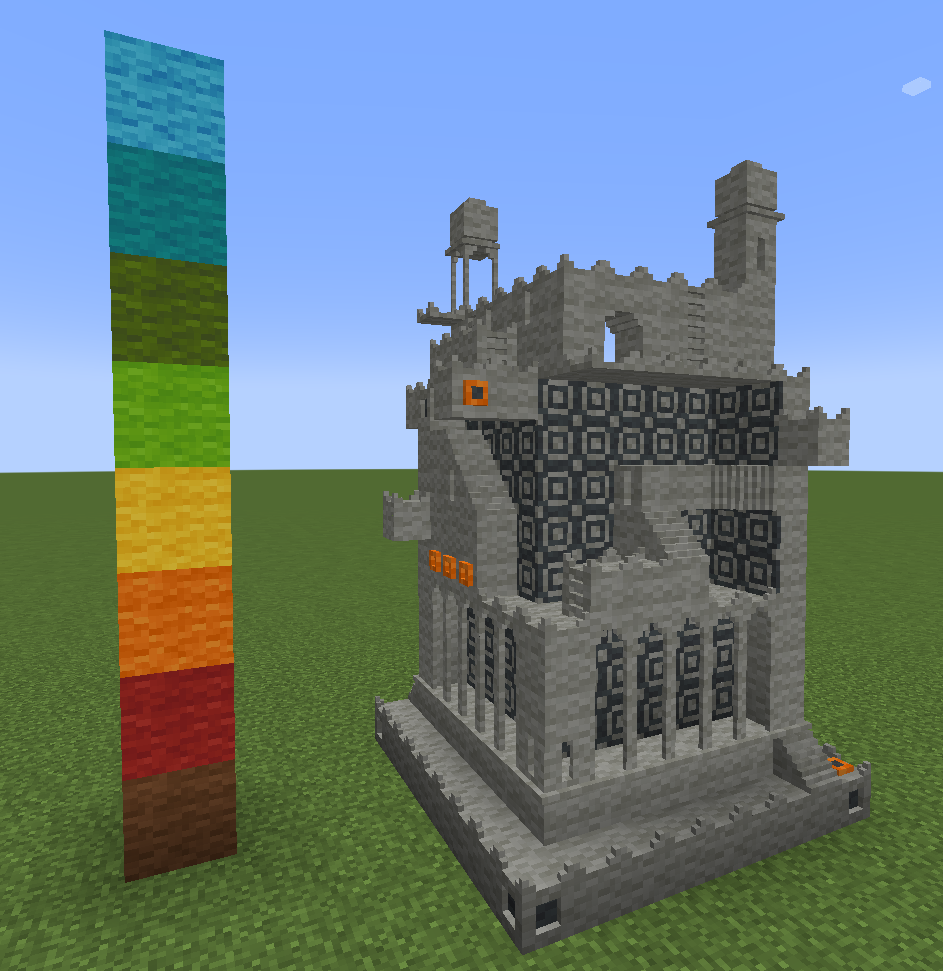

# Chisels and Importers

An importer for [Chisels and Bits](https://github.com/ChiselsAndBits/Chisels-and-Bits) that converts [Magica Voxel](https://ephtracy.github.io/) files into in-game patterns.



## Usage


Use the Magica Voxel software to create a voxel model (or convert a obj file) and save it.

Download the latest release from the releases tab, then run the program:

```
chisels_and_importers.exe <PATH TO YOUR MODEL FILE>
```

It will create one or more "pattern.cbsbp" files.
Copy them to your Minecraft installation under ".minecraft/chiselsandbits/patterns".

Once you are in-game, run the command to import the pattern:
```
/candb load pattern_0
```
This will give you the pattern item to place.

Larger models will result in multiple patterns, as a pattern can only place one block.
You can use the scale function in Magica Voxel to reduce the size if required.

## Choosing blocks

The blocks to pick for each color in the voxel model are defined in JSON files.
The default ["blocks.json"](blocks.json) file uses wool blocks.

The color listed in the JSON file does not have to be exact, the importer will pick the closest match.

## Compatibility

Tested with Minecraft 1.20.1.
Different versions may or may not work.
